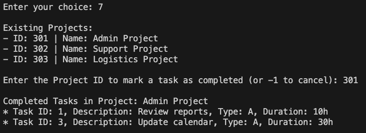

# SENG1110 Assignment 2 Report

## 1. Time Tracking

Breakdown of estimated time spent:

## ⏱️ Time Tracking

| **Activity**                                   | **Hours Spent** |
|------------------------------------------------|-----------------|
| Designing (structure, planning features)       | 6               |
| Coding (all versions incl. rewrite & refactor) | 20              |
| Testing (manual, edge cases, checklist)        | 10              |
| Debugging/Fixes (validation logic, handling)   | 8               |
| Cleanup (comments, structure, Javadoc, polish) | 6               |
| **Total**                                      | **50 hours**    |

## 2. Error Analysis

### 🐞 Error Source Breakdown (Based on Testing, Debugging, and Cleanup Time)

Total time spent on testing, debugging, and cleanup: **24 hours**

| Error Source               | Hours | Percentage |
|---------------------------|-------|------------|
| Coding/Implementation     | 17    | ~70%       |
| Design                    | 7     | ~30%       |
| **Total**                 | 24    | 100%       |

### 🛠️ Error Analysis & Reflection

Most of my errors came from refactoring the original code from Assignment 1. I initially tried to build on that version, but quickly realised it would be faster and cleaner to start from scratch. The original structure lacked flexibility, and retrofitting new features into it caused more problems than it solved.

I probably went a bit overboard with helper methods and ended up creating more than necessary. I didn't plan them. As I was refactoring code, if I felt something might become reusable, I made a helper method. Some of helper methods even ended up with helper methods! While they helped keep the logic modular and readable, some feel redundant or overly specific. With more time, I could definitely streamline the code further and apply DRY (Don't Repeat Yourself) principles more consistently.

## 3. Program Functionality Screenshots

## 📸 Program Demonstration

### 🧭 Main Menu  

### 🆕 Create Project  

### ❌ Remove Project  

### ➕ Add Task  

### ✅ Mark Task as Completed  

### 🗑️ Remove Task  

### 📋 Display All Projects  

### 📌 Display Completed Tasks  

### 🔍 Filter Tasks by Type  

### 📊 Display Task Averages  

### 📂 Load from File with Error Handling  

### 💾 Save to File  

### 👋 Exit Program  

## 4. Inheritance Discussion

### How inheritance **could be used**:

- `Project` superclass → subclasses for `SmallProject`, `MediumProject`, `LargeProject`
- `Task` superclass → potential subclasses like `AdminTask`, `SupportTask`, `LogisticsTask`

I inheritance wsn't used in this project, but it could be a useful way to clean things up if the system needed to grow. 

For example, instead of using a `char` to track task types like `‘A’, ‘S’, ‘L’,` you could have a base `Task` class with `AdminTask`, `SupportTask`, and `LogisticsTask` subclasses. 

Each subclass could handle its own behaviour and return its type through a `getTaskType()` method, removing the need for if or switch statements.

The same could be done for projects. You could have one `Project` class and then `SmallProject`, `MediumProject`, and `LargeProject` subclasses, each with their own task limit built in. Cut down on the need to validiate how many tasks from the `UserInterface` class.

## 5. Use of Disallowed Topics

### 🚫 Use of Disallowed Topics

To the best of my knowledge, I have not used any concepts or tools outside the scope of Weeks 1–12. The inclusion of `arrays` and `try-catch` exception handling made it much easier to handle errors gracefully, and both were clearly covered in lectures.

I used Java’s `Random` class to generate unique IDs for projects and tasks. While I can’t recall if it was explicitly demonstrated in class, I'm familiar with the functionality of random number generators from previous study. It’s a common technique and well-documented in standard Java resources. For reference, here’s a related I used [Stack Overflow thread](https://stackoverflow.com/questions/363681/how-do-i-generate-random-integers-within-a-specific-range-in-java/).

